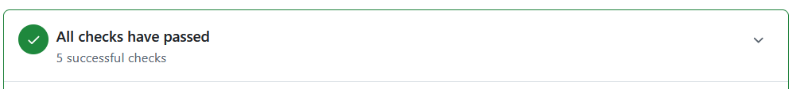
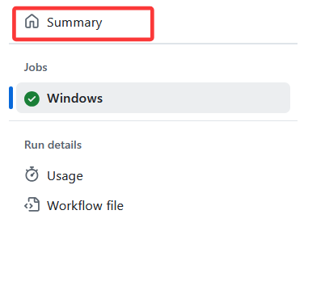
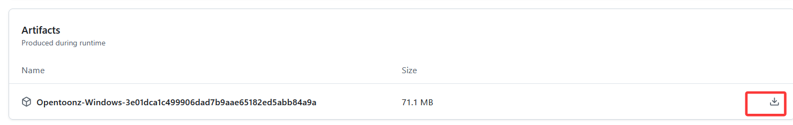

# 测试拉取请求 (PR)

当一个PR被提交时会通过 AppVeyor 以及Github Action自动编译，并生成构件（压缩包）。构件中包含了OpenToonz主程序以及相关的dll文件。

你可以直接下载这些构件来在PR被合并前测试它。

## 测试前的注意点

- 不需要卸载原有的OpenToonz。
- 建议在测试前备份你的 `C:\OpenToonz stuff` 文件夹，以及场景。
- 建议创建无关紧要的新场景进行测试。

## 下载并测试 AppVeyor 构件

1. 前往你感兴趣的PR页面。

2. 滑动到底部，找到一个绿色框线包围的提示框，上面写着 `All checks have passed` 。点击旁边的箭头展开。

3. 找到一行文字 `AppVeyor build succeeded` ，然后点击旁边的三点，选择View Details。

4. 点击 `Configuration: Release`。

5. 在页面的右半边，点击 `Artifacts`。

6. 点击 OpenToonz `.zip` 文件开始下载。

## 下载并测试 Github Action 构件

1. 与前文类似，但从第3步开始点击其他行

2. 进入到Details页面后点击页面左侧的Summary

3. 向下翻，可以找到下载按钮

   

---

- 下载完成后，打开下载文件夹，然后解压压缩包到电脑上任何一个空文件夹。
 - ⚠️ **不要覆盖已经安装的 OpenToonz ！！**
- 进入解压后的文件夹，然后双击`OpenToonz.exe`启动程序。
- 可以开始测试功能。如果有任何建议或者问题，请在PR底下评论。
- 测试完成后可以直接删除压缩包和解压后的文件夹。
